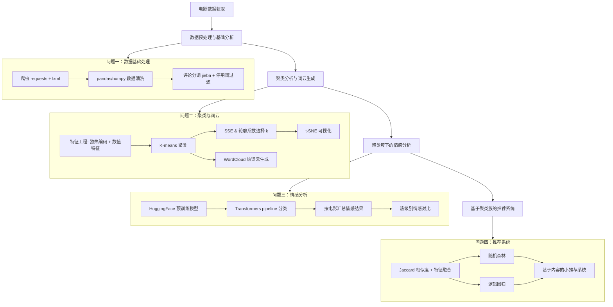

```mermaid
flowchart TD
    A[电影数据获取] --> B[数据预处理与基础分析]
    B --> C[聚类分析与词云生成]
    C --> D[聚类簇下的情感分析]
    D --> E[基于聚类簇的推荐系统]

    subgraph Q1[问题一：数据基础处理]
        B1[爬虫 requests + lxml] --> B2[pandas/numpy 数据清洗]
        B2 --> B3[评论分词 jieba + 停用词过滤]
    end
    B --> Q1

    subgraph Q2[问题二：聚类与词云]
        C1[特征工程: 独热编码 + 数值特征] --> C2[K-means 聚类]
        C2 --> C3[SSE & 轮廓系数选择 k]
        C3 --> C4[t-SNE 可视化]
        C2 --> C5[WordCloud 热词云生成]
    end
    C --> Q2

    subgraph Q3[问题三：情感分析]
        D1[HuggingFace 预训练模型] --> D2[Transformers pipeline 分类]
        D2 --> D3[按电影汇总情感结果]
        D3 --> D4[簇级别情感对比]
    end
    D --> Q3

    subgraph Q4[问题四：推荐系统]
        E1[Jaccard 相似度 + 特征融合] --> E2[随机森林]
        E1 --> E3[逻辑回归]
        E2 --> E4[基于内容的小推荐系统]
        E3 --> E4
    end
    E --> Q4
```
